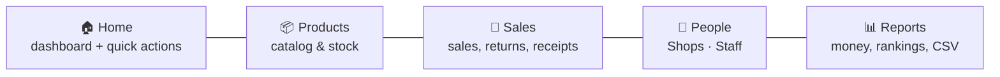
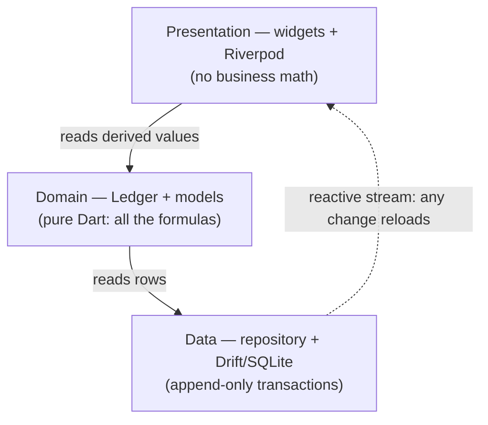

# Store Manager

An **offline-first** app that replaces a small shop owner's paper registers. The owner buys
products, hands them to **staff (salespersons)** on credit, and is paid back over time as the
goods sell on. Separately, a book of **shops (customers)** tracks the retailers they sell to —
who buys most, and who's a loyal, long-term customer.

Enter each product once, record movements with a few taps, and every balance, stock count, and
profit figure is calculated automatically.

## Key ideas

- **Offline-first** — works with no internet; all data is local. No server, no login.
- **The ledger is the truth** — every balance and total is *derived by summing transactions*, never stored. The books always reconcile.
- **Enter once, pick everywhere** — products, staff, and shops are typed once, then selected.
- **Correct money** — integer minor units (never floating point); profit recognised on a cash basis as payments arrive.

### Staff vs shops

| | **Staff** (salespersons) | **Shops** (customers) |
|---|---|---|
| Who | People you hire to move goods | Retailers who buy to resell |
| Money | Take goods **on credit**, owe a balance, pay back | A simple **purchase log** — no credit |
| Shows | Stock, cash, owed, profit | Who buys most / newest / most loyal |

Both live under the **People** tab as two segments.

## The app at a glance



Five movements drive everything: **Stock in** (stock ↑, cash ↓), **Sale** (stock ↓, owed ↑),
**Return** (stock ↑, owed ↓), **Payment** (cash ↑, owed ↓, profit recognised), and **Expense**
(cash ↓). Shop purchases are a separate customer log and don't touch these figures.

## Architecture

Three layers. A change to any table re-derives the whole `Ledger`, so every screen refreshes
automatically.



- **Data** (`lib/data/`) — Drift tables and repository.
- **Domain** (`lib/domain/`) — pure Dart models and every stock/money/profit formula; fully unit-tested.
- **Presentation** (`lib/screens/`, `lib/sheets/`) — providers expose derived values; widgets render them.

## Tech stack

Flutter · Drift (SQLite, reactive) · Riverpod · `pdf`/`printing` · `csv`/`share_plus` · PIN +
biometric app lock with password-protected backups.

## Getting started

```bash
flutter pub get
dart run build_runner build --force-jit   # generate Drift code
flutter run -d chrome                      # web is the primary local target
flutter test
```

Fresh installs start empty — use **Settings → Load demo data** to explore.

## Building

```bash
flutter build apk --release        # Android (see notes below)
flutter build web --release        # Web → build/web/
flutter build appbundle --release  # Google Play (.aab)
```

Release builds are signed with the debug key by default (fine for sideloading; the Play Store
needs a real keystore wired into `android/app/build.gradle.kts`).

## More

The full specification — data model, exact formulas, and the golden test fixture — lives in
[CLAUDE.md](CLAUDE.md).
